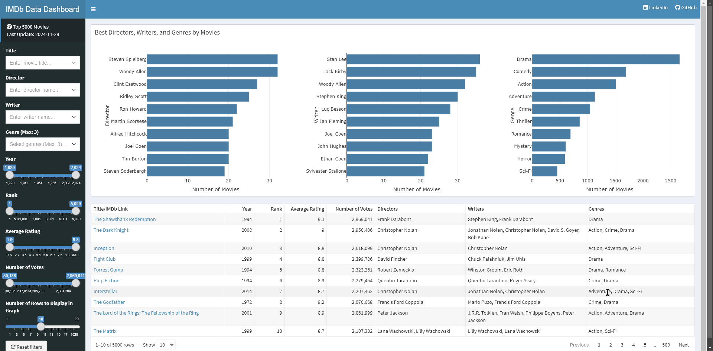
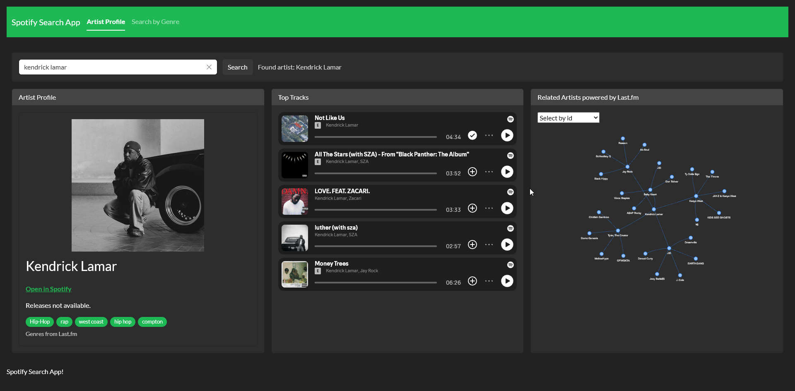
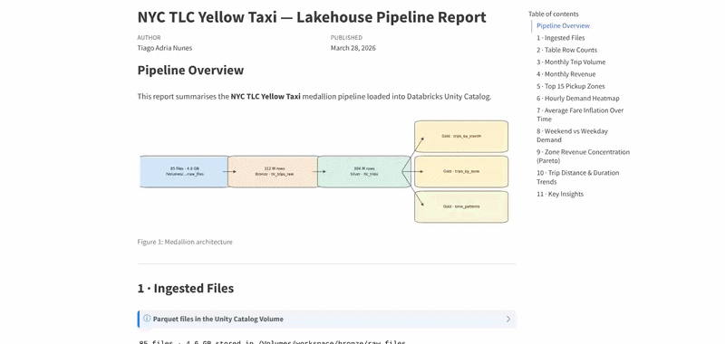

# Tiago Adria Nunes

[ Email](mailto:tiagoadrianunes@gmail.com) [ LinkedIn](https://www.linkedin.com/in/tiago-adria-nunes/) [ GitHub](https://github.com/TiagoAdriaNunes)

Hi, I’m **Tiago Adria Nunes** - an **R/Shiny Developer** with 10+ years in IT, specializing in data-driven web applications, interactive dashboards, and process automation. I’ve led development teams across **banking**, **healthcare**, **education**, and **insurance**, and I bring the same analytical rigour to both technical and business problems.

## Projects

### [IMDb Top 5000](https://github.com/TiagoAdriaNunes/imdb_top_5000)

R Shiny ShinyApps.io

Interactive dashboard showcasing the top 5000 movies from IMDb, sourced live from [IMDb datasets](https://datasets.imdbws.com/). Filter by title, director, genre, year, rank, rating, and vote count.

- Filter by title, director, genre, year, rank, rating, and votes
- TV Shows edition: [IMDb Top 5000 TV Shows](https://github.com/TiagoAdriaNunes/imdb_top_5000_tv_shows) - same filtering approach applied to series and TV content

[GitHub](https://github.com/TiagoAdriaNunes/imdb_top_5000) · [Live App](https://tiagoadrianunes.shinyapps.io/IMDB_TOP_5000/)

Click to launch the app

### [Last.fm Global Trends](https://github.com/TiagoAdriaNunes/lastfm-global-trends)

Python Shiny Last.fm API

Interactive dashboard connecting to the Last.fm API to explore global and country-level music trends in real time.

- Real-time Last.fm API integration via pylast
- Global and country-level trend drill-down

[GitHub](https://github.com/TiagoAdriaNunes/lastfm-global-trends) · [Live App](https://tiagoadrianunes.shinyapps.io/lastfm-global-trends/)

Click to launch the app

### [Spotify Search App](https://github.com/TiagoAdriaNunes/shiny_spotify)

R Shiny Rhino Spotify API

Search for artists, explore their profiles, top tracks, and related artists via the Spotify API. Includes genre-based discovery and network visualization of artist relationships.

- Artist profiles with top tracks and related-artist network graph
- Genre-based discovery with popularity and follower metrics
- API caching via memoise; built with the enterprise-grade Rhino framework

[GitHub](https://github.com/TiagoAdriaNunes/shiny_spotify) · [Live App](https://tiagoadrianunes.shinyapps.io/shiny_spotify/)

Click to launch the app

### [Databricks Ingestion Lakehouse](https://github.com/TiagoAdriaNunes/databricks-ingestion-lakehouse)

Python PySpark Databricks Delta Lake Docker

End-to-end data ingestion pipeline using NYC TLC Yellow Taxi data, organised into a **Bronze → Silver → Gold** medallion architecture. Runs both locally via Docker (PySpark + Delta Lake) and on Databricks (Unity Catalog + SQL Warehouse).

- Bronze: raw Parquet ingestion into Delta tables with metadata
- Silver: cleaning, filtering, and enrichment with derived columns
- Gold: analytics-ready aggregations for trip volume, revenue, zone performance, and time patterns
- Live analytics report published via GitHub Pages

[GitHub](https://github.com/TiagoAdriaNunes/databricks-ingestion-lakehouse) · [Live Report](https://tiagoadrianunes.github.io/databricks-ingestion-lakehouse/)

Click to view the live report

### [Airflow DBT DuckDB Pipeline](https://github.com/TiagoAdriaNunes/airflow-dbt-duckdb)

Python Airflow DBT DuckDB DuckLake Grafana Prometheus Docker

End-to-end data pipeline orchestrating dbt transformations via Astronomer Cosmos on Apache Airflow, with DuckDB + DuckLake as the analytical engine and open table format, backed by a full observability stack.

- Daily DAG: TPC-H data generation → dbt Cosmos task group (one Airflow task per model) → staging and mart layers
- DuckLake open table format with Parquet data files and PostgreSQL catalog
- Observability: ducklake-metrics exporter → OpenTelemetry Collector → Prometheus → Grafana dashboards

[GitHub](https://github.com/TiagoAdriaNunes/airflow-dbt-duckdb)

### [dbt + pg_duckdb](https://github.com/TiagoAdriaNunes/dbt_pg_duckdb)

Python DBT DuckDB PostgreSQL Docker

Dockerized PostgreSQL with the pg_duckdb extension and a dbt project for analytics transformations on TPC-H benchmark data. Every query is routed through DuckDB’s vectorized columnar engine via an `on-run-start` hook.

- Staging → Mart → Snapshot layers with enforced model contracts and SCD2 history
- Incremental models, automated data quality tests, and lineage DAG
- Live dbt docs auto-published to GitHub Pages on every push to main

[GitHub](https://github.com/TiagoAdriaNunes/dbt_pg_duckdb) · [Live Docs](https://tiagoadrianunes.github.io/dbt_pg_duckdb/)

## Skills

**Languages & Frameworks**

R Shiny Quarto Tidyverse ggplot2 SparkR Python PySpark Pandas NumPy Matplotlib SQL

**Data & Analytics**

Data Modeling ELT/ETL DBT DuckDB Delta Lake Power BI Tableau

**Process & Delivery**

Business Analysis BPMN UML Scrum Kanban Jira Confluence

## Education

- 2023–2024 - Postgraduate in Software Engineering - Descomplica
- 2006–2009 - B.A. in Business Administration - Anhanguera

## Certifications

- [Google Advanced Data Analytics Professional Certificate](https://www.coursera.org/professional-certificates/google-advanced-data-analytics) - Coursera, 2023
- [Data Science: Foundations using R](https://www.coursera.org/specializations/data-science-foundations-r) - Coursera, 2023
- [Google Data Analytics Professional Certificate](https://www.coursera.org/professional-certificates/google-data-analytics) - Coursera, 2022
- [Software Product Management Specialization](https://www.coursera.org/specializations/software-product-management) - Coursera, 2018

## Contact

<tiagoadrianunes@gmail.com> · [LinkedIn](https://www.linkedin.com/in/tiago-adria-nunes/) · [GitHub](https://github.com/TiagoAdriaNunes)
