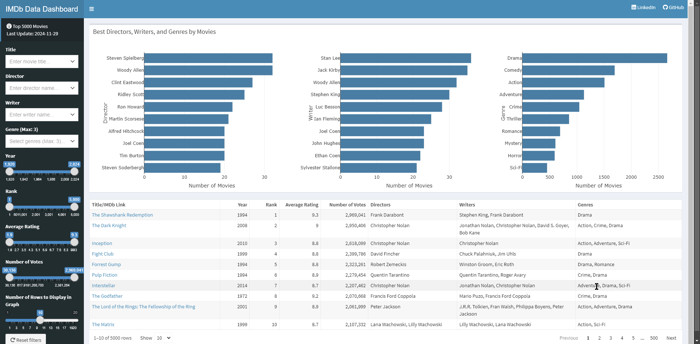
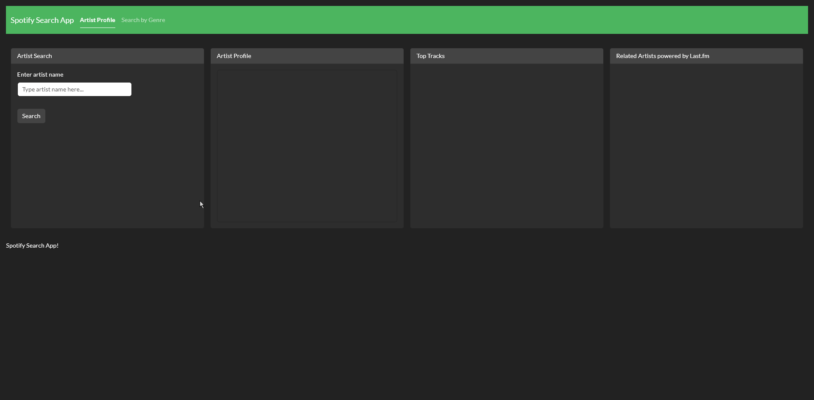

::: {#me}
Hi, I'm **Tiago Adria Nunes** — an **R/Shiny Developer** with 10+ years in IT, specializing in data-driven web applications, interactive dashboards, and process automation. I've led development teams across **banking**, **healthcare**, **education**, and **insurance**, and I bring the same analytical rigour to both technical and business problems.

:::

## Projects

### [IMDb Top 5000](https://github.com/TiagoAdriaNunes/imdb_top_5000){target="_blank"} — R/Shiny

Interactive dashboard showcasing the top 5000 movies from IMDb, sourced live from [IMDb datasets](https://datasets.imdbws.com/){target="_blank"}. Filter by title, director, genre, year, rank, rating, and vote count.

- Filter by title, director, genre, year, rank, rating, and votes
- TV Shows edition: [IMDb Top 5000 TV Shows](https://github.com/TiagoAdriaNunes/imdb_top_5000_tv_shows){target="_blank"} — same filtering approach applied to series and TV content

[GitHub](https://github.com/TiagoAdriaNunes/imdb_top_5000){target="_blank"} · [Live App](https://tiagoadrianunes.shinyapps.io/IMDB_TOP_5000/){target="_blank"}

[{target="_blank" fig-alt="IMDb Top 5000 app demo" width="1280"}](https://tiagoadrianunes.shinyapps.io/IMDB_TOP_5000/){target="_blank"}

---

### [Last.fm Global Trends](https://github.com/TiagoAdriaNunes/lastfm-global-trends){target="_blank"} — Python/Shiny

Interactive dashboard connecting to the Last.fm API to explore global and country-level music trends in real time.

- Real-time Last.fm API integration via pylast
- Global and country-level trend drill-down

[GitHub](https://github.com/TiagoAdriaNunes/lastfm-global-trends){target="_blank"} · [Live App](https://tiagoadrianunes.shinyapps.io/lastfm-global-trends/){target="_blank"}

[{target="_blank" fig-alt="Last.fm Global Trends app demo" width="1280"}](https://tiagoadrianunes.shinyapps.io/lastfm-global-trends/){target="_blank"}

---

### [Spotify Search App](https://github.com/TiagoAdriaNunes/shiny_spotify){target="_blank"} — R/Shiny

Search for artists, explore their profiles, top tracks, and related artists via the Spotify API. Includes genre-based discovery and network visualization of artist relationships.

- Artist profiles with top tracks and related-artist network graph
- Genre-based discovery with popularity and follower metrics
- API caching via memoise; built with the enterprise-grade Rhino framework

[GitHub](https://github.com/TiagoAdriaNunes/shiny_spotify){target="_blank"} · [Live App](https://tiagoadrianunes.shinyapps.io/shiny_spotify/){target="_blank"}

[{target="_blank" fig-alt="Spotify Search App demo" width="1280"}](https://tiagoadrianunes.shinyapps.io/shiny_spotify/){target="_blank"}

---

### [Airflow DBT DuckDB Pipeline](https://github.com/TiagoAdriaNunes/airflow-dbt-duckdb){target="_blank"} — Python/Airflow/DBT

A modern ELT pipeline orchestrating DBT transformations with Apache Airflow and DuckDB, including automated data quality tests and lineage documentation.

- Airflow for scheduling and orchestration
- DBT for SQL-based transformations with built-in testing
- DuckDB as a lightweight embedded analytical database

[GitHub](https://github.com/TiagoAdriaNunes/airflow-dbt-duckdb){target="_blank"}

---

## Skills

**Languages & Frameworks**
R (Shiny, Quarto, Tidyverse, ggplot2, SparkR) · Python (Shiny, Pandas, NumPy, Matplotlib, PySpark) · SQL

**Data & Analytics**
Data modeling · ELT/ETL pipelines · DBT · DuckDB · Power BI · Tableau

**Process & Delivery**
Business Analysis · BPMN · UML · Scrum · Kanban · Jira · Confluence

## Education

- 2023–2024 — Postgraduate in Software Engineering — Descomplica
- 2006–2009 — B.A. in Business Administration — Anhanguera

## Certifications

- [Google Advanced Data Analytics Professional Certificate](https://www.coursera.org/professional-certificates/google-advanced-data-analytics){target="_blank"} — Coursera, 2023
- [Data Science: Foundations using R](https://www.coursera.org/specializations/data-science-foundations-r){target="_blank"} — Coursera, 2023
- [Google Data Analytics Professional Certificate](https://www.coursera.org/professional-certificates/google-data-analytics){target="_blank"} — Coursera, 2022
- [Software Product Management Specialization](https://www.coursera.org/specializations/software-product-management){target="_blank"} — Coursera, 2018

## Contact

[tiagoadrianunes@gmail.com](mailto:tiagoadrianunes@gmail.com) · [LinkedIn](https://www.linkedin.com/in/tiago-adria-nunes/){target="_blank"} · [GitHub](https://github.com/TiagoAdriaNunes){target="_blank"}
