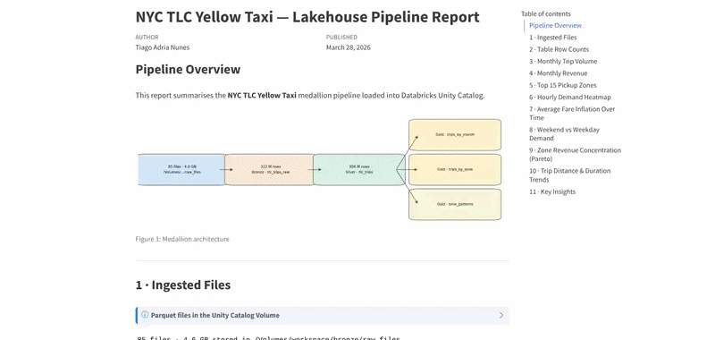

::: {#me}
Hi, I'm **Tiago Adria Nunes** - an **R/Shiny Developer** with 10+ years in IT, specializing in data-driven web applications, interactive dashboards, and process automation. I've led development teams across **banking**, **healthcare**, **education**, and **insurance**, and I bring the same analytical rigour to both technical and business problems.

:::

## Projects

::: {.project-card}
### [IMDb Top 5000](https://github.com/TiagoAdriaNunes/imdb_top_5000){target="_blank"}

::: {.badges}
[R]{.badge} [Shiny]{.badge} [ShinyApps.io]{.badge}
:::

Interactive dashboard showcasing the top 5000 movies from IMDb, sourced live from [IMDb datasets](https://datasets.imdbws.com/){target="_blank"}. Filter by title, director, genre, year, rank, rating, and vote count.

- Filter by title, director, genre, year, rank, rating, and votes
- TV Shows edition: [IMDb Top 5000 TV Shows](https://github.com/TiagoAdriaNunes/imdb_top_5000_tv_shows){target="_blank"} - same filtering approach applied to series and TV content

[GitHub](https://github.com/TiagoAdriaNunes/imdb_top_5000){target="_blank"} · [Live App](https://tiagoadrianunes.shinyapps.io/IMDB_TOP_5000/){target="_blank"}

[{target="_blank" fig-alt="IMDb Top 5000 app demo" width="1280"}](https://tiagoadrianunes.shinyapps.io/IMDB_TOP_5000/){target="_blank"}
:::

::: {.project-card}
### [Last.fm Global Trends](https://github.com/TiagoAdriaNunes/lastfm-global-trends){target="_blank"}

::: {.badges}
[Python]{.badge} [Shiny]{.badge} [Last.fm API]{.badge}
:::

Interactive dashboard connecting to the Last.fm API to explore global and country-level music trends in real time.

- Real-time Last.fm API integration via pylast
- Global and country-level trend drill-down

[GitHub](https://github.com/TiagoAdriaNunes/lastfm-global-trends){target="_blank"} · [Live App](https://tiagoadrianunes.shinyapps.io/lastfm-global-trends/){target="_blank"}

[{target="_blank" fig-alt="Last.fm Global Trends app demo" width="1280"}](https://tiagoadrianunes.shinyapps.io/lastfm-global-trends/){target="_blank"}
:::

::: {.project-card}
### [Spotify Search App](https://github.com/TiagoAdriaNunes/shiny_spotify){target="_blank"}

::: {.badges}
[R]{.badge} [Shiny]{.badge} [Rhino]{.badge} [Spotify API]{.badge}
:::

Search for artists, explore their profiles, top tracks, and related artists via the Spotify API. Includes genre-based discovery and network visualization of artist relationships.

- Artist profiles with top tracks and related-artist network graph
- Genre-based discovery with popularity and follower metrics
- API caching via memoise; built with the enterprise-grade Rhino framework

[GitHub](https://github.com/TiagoAdriaNunes/shiny_spotify){target="_blank"} · [Live App](https://tiagoadrianunes.shinyapps.io/shiny_spotify/){target="_blank"}

[{target="_blank" fig-alt="Spotify Search App demo" width="1280"}](https://tiagoadrianunes.shinyapps.io/shiny_spotify/){target="_blank"}
:::

::: {.project-card}
### [Databricks Ingestion Lakehouse](https://github.com/TiagoAdriaNunes/databricks-ingestion-lakehouse){target="_blank"}

::: {.badges}
[Python]{.badge} [PySpark]{.badge} [Databricks]{.badge} [Delta Lake]{.badge} [Docker]{.badge}
:::

End-to-end data ingestion pipeline using NYC TLC Yellow Taxi data, organised into a **Bronze → Silver → Gold** medallion architecture. Runs both locally via Docker (PySpark + Delta Lake) and on Databricks (Unity Catalog + SQL Warehouse).

- Bronze: raw Parquet ingestion into Delta tables with metadata
- Silver: cleaning, filtering, and enrichment with derived columns
- Gold: analytics-ready aggregations for trip volume, revenue, zone performance, and time patterns
- Live analytics report published via GitHub Pages

[GitHub](https://github.com/TiagoAdriaNunes/databricks-ingestion-lakehouse){target="_blank"} · [Live Report](https://tiagoadrianunes.github.io/databricks-ingestion-lakehouse/){target="_blank"}

[{target="_blank" fig-alt="Databricks Ingestion Lakehouse pipeline report" width="1280"}](https://tiagoadrianunes.github.io/databricks-ingestion-lakehouse/){target="_blank"}
:::

::: {.project-card}
### [Airflow DBT DuckDB Pipeline](https://github.com/TiagoAdriaNunes/airflow-dbt-duckdb){target="_blank"}

::: {.badges}
[Python]{.badge} [Airflow]{.badge} [DBT]{.badge} [DuckDB]{.badge}
:::

A modern ELT pipeline orchestrating DBT transformations with Apache Airflow and DuckDB, including automated data quality tests and lineage documentation.

- Airflow for scheduling and orchestration
- DBT for SQL-based transformations with built-in testing
- DuckDB as a lightweight embedded analytical database

[GitHub](https://github.com/TiagoAdriaNunes/airflow-dbt-duckdb){target="_blank"}
:::

## Skills

::: {.skills-group}
**Languages & Frameworks**

[R]{.badge} [Shiny]{.badge} [Quarto]{.badge} [Tidyverse]{.badge} [ggplot2]{.badge} [SparkR]{.badge} [Python]{.badge} [PySpark]{.badge} [Pandas]{.badge} [NumPy]{.badge} [Matplotlib]{.badge} [SQL]{.badge}
:::

::: {.skills-group}
**Data & Analytics**

[Data Modeling]{.badge} [ELT/ETL]{.badge} [DBT]{.badge} [DuckDB]{.badge} [Delta Lake]{.badge} [Power BI]{.badge} [Tableau]{.badge}
:::

::: {.skills-group}
**Process & Delivery**

[Business Analysis]{.badge} [BPMN]{.badge} [UML]{.badge} [Scrum]{.badge} [Kanban]{.badge} [Jira]{.badge} [Confluence]{.badge}
:::

## Education

- 2023–2024 - Postgraduate in Software Engineering - Descomplica
- 2006–2009 - B.A. in Business Administration - Anhanguera

## Certifications

- [Google Advanced Data Analytics Professional Certificate](https://www.coursera.org/professional-certificates/google-advanced-data-analytics){target="_blank"} - Coursera, 2023
- [Data Science: Foundations using R](https://www.coursera.org/specializations/data-science-foundations-r){target="_blank"} - Coursera, 2023
- [Google Data Analytics Professional Certificate](https://www.coursera.org/professional-certificates/google-data-analytics){target="_blank"} - Coursera, 2022
- [Software Product Management Specialization](https://www.coursera.org/specializations/software-product-management){target="_blank"} - Coursera, 2018

## Contact

[tiagoadrianunes@gmail.com](mailto:tiagoadrianunes@gmail.com) · [LinkedIn](https://www.linkedin.com/in/tiago-adria-nunes/){target="_blank"} · [GitHub](https://github.com/TiagoAdriaNunes){target="_blank"}
